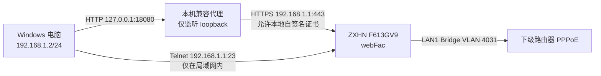

# 中兴 ZXHN F613GV9 V9.0 / V2.2.0P1T11：2025年末新版 HTTPS FactoryMode、Telnet固化、桥接与真正关闭TR-069实录

> 本文记录一次真实成功的家庭光猫改桥接过程。测试设备为河南移动定制的中兴 `ZXHN F613GV9`，硬件 `V9.0`，软件 `V2.2.0P1T11`。
>
> 只应操作自己拥有或已获授权管理的设备。恢复出厂、删除 WAN、修改 PON 参数或关闭 TR-069 都可能导致断网、语音/IPTV 失效、运营商无法远程维护，甚至只能由装维重新注册。务必先备份。

> ⭐ 如果这份教程确实帮到了你，欢迎点击仓库右上角的 **Star** 支持后续维护和更多设备反馈整理。Star不是阅读、下载或使用本项目的前提。

完全没有经验、只想按顺序操作的读者，请先看：[傻瓜版一步一步教程](BEGINNER_GUIDE.md)。遇到异常或想了解原理时，再回到本文。

## 1. 结论先行

这台 F613GV9 的难点不是普通 Web 超密，而是新版、MAC 绑定的 `webFac` FactoryMode 流程：

- `80`、`8080` 虽然开放，但公开旧工具不能完成这版固件的握手。
- 可工作的 FactoryMode 接口实际位于自签名证书的 `HTTPS 443`。
- 新协议返回 `re_rand`，并把会话绑定到直连电脑的有线 MAC。
- 实测一次有效 `/webFacEntry` 响应长度为 44 字节：前 32 字节是完整 AES 块，后面额外追加 12 字节。旧工具把全部 44 字节交给 AES 解密时会失败。
- 使用仅监听 `127.0.0.1` 的 HTTPS 兼容代理，保留设备响应，但只向旧工具转发完整 AES 块后，成功取得临时 Telnet 凭据。
- 成功标准不是“工具打印了账号”，而是 `23/TCP` 确实开放，并能用临时凭据登录光猫 shell。

社区更准确的分界是“2025年9月后的新方案”，并非所有型号都在12月同一天更新。本项目在2026年实测解决这台F613GV9的困难组合：真实来源MAC校验、自签名HTTPS，以及44字节响应中32字节AES密文后追加12字节尾部。旧固件可先参考传统教程；本文重点补齐旧方法失效后的路径。

最终实测配置：

| 项目 | 最终状态 |
| --- | --- |
| Internet WAN | `2_INTERNET_B_VID_4031` |
| 模式 | IPv4/IPv6 Bridge |
| VLAN | `4031`，由光猫负责打 Tag |
| 端口绑定 | 仅 LAN1 |
| 光猫 NAT | 关闭 |
| TR-069 WAN | 已删除 |
| TR-069 客户端 | 已关闭，ACS 重定向到 `127.0.0.1` |
| Telnet | 仅 LAN 开启，WAN 关闭，随机强密码 |
| Web 空闲超时 | 120 分钟 |
| UPnP | 关闭 |

`4031` 不是账号密码，但属于地区/运营商业务参数。它只代表本次河南移动线路；其他地区必须从自己的原始 WAN 配置读取，不能照抄。

## 2. 本次实际经历的时间线

1. 从普通后台记录 PON 注册资料、原 Internet/TR-069 WAN、VLAN、光功率和 LAN 状态，并用 U 盘导出完整配置。
2. 在光纤断开的状态下取得超管后台访问，写回并复核 PON 注册参数。
3. 通过超管页面先创建 VLAN 4031 Bridge，再恢复页面原有的 `pageDel` 处理函数，删除被锁住的 TR-069 WAN。
4. 依次测试 `factorymode_crack-v2`、`ZTETelnet`、公开 `zteOnu` 和配置文件离线解密；这些路线在本型号/固件上都没有直接完成临时 Telnet 登录。
5. 审计社区 `go_build_zte_go.exe` 后发现它支持 `re_rand` 和客户端 MAC，但直接访问 HTTPS 会被自签名证书及异常长度 AES 响应阻断。
6. 编写 loopback-only HTTPS 兼容代理，确认固件在 32 字节 AES 密文后追加了 12 字节尾部；只转发完整 AES 块后取得临时凭据，并实际登录 Telnet。
7. 使用随机强密码固化 LAN Telnet，关闭 WAN Telnet，保存数据库并重启验证。
8. 通过 Telnet 确认删除 TR-069 WAN 仍不足以关闭内部 CWMP，再关闭 `MgtServer` 上报、桥接残留 NAT、光猫防火墙/ALG/UPnP，并把 Web 超时延长到 120 分钟。
9. 插回光纤，确认 O5，由下级 TP-Link 路由器 PPPoE 拨号。
10. 后续排查“千兆只有百兆、偶发 PPPoE 重拨”时，发现 WAN 物理协商仅 100Mbps，最终定位到光猫—路由器网线水晶头氧化/接触不良，与 FactoryMode/桥接配置无关。

## 3. 流程与数据边界



兼容代理不需要访问互联网，也不应监听 `0.0.0.0`。FactoryMode 工具中的管理凭据只发往本机 loopback，再由代理转给 `192.168.1.1`。

## 4. 本文占位符

不同设备的账号、注册资料、MAC和VLAN都不同，本文统一用以下占位符表示需要读者填写的实际值：

```text
<SUPERADMIN_USERNAME>
<SUPERADMIN_PASSWORD>
<PC_ETHERNET_MAC_12_HEX>
<TEMP_TELNET_USER>
<TEMP_TELNET_PASSWORD>
<STRONG_RANDOM_PASSWORD>
<LOID>
<PON_PASSWORD>
<GPON_SN>
<PPPOE_USERNAME>
<PPPOE_PASSWORD>
<YOUR_INTERNET_VLAN>
```

## 5. 动手前备份

### 5.1 先记录运行态

至少使用纸笔、离线文本或截图保存以下项目：

- 型号、硬件版本、软件版本；
- LOID、PON Password、GPON SN；
- 每一条 WAN 的名称、业务类型、连接模式、VLAN、802.1p、NAT、端口绑定；
- Internet、TR-069、语音、IPTV 的独立配置；
- PPPoE 账号密码；
- PON 状态、收发光功率；
- LAN 口协商速率；
- 原配置截图。

本次原始配置包含：

- 路由 Internet：`2_INTERNET_R_VID_4031`；
- 管理 WAN：`1_TR069_R_VID_4034`。

这两个 VLAN 只用于解释本次过程，不是通用模板。

### 5.2 导出配置

U盘不是必需品；三个PON注册资料和WAN参数可以手抄。如果超管后台提供USB备份，建议再额外保存：

- 首次/完整配置 `*.cfg`；
- `paramtag` 或参数标签文件；
- 文件大小和 SHA-256。

Windows 可用：

```powershell
Get-FileHash -Algorithm SHA256 -LiteralPath '<BACKUP_FILE>'
```

不要因为导出了文件就跳过人工记录。某些 F613GV9 配置使用设备专属密钥，离线工具未必能够解密。

### 5.3 PPPoE账号密码

PPPoE凭据是下级路由器“宽带拨号”使用的账号密码，不是Wi-Fi或光猫后台密码。本次河南移动线路实测可使用办理宽带时绑定的手机号发送 `CZKDMM` 到 `10086`，系统回复随机宽带密码。其他省份或运营商指令可能不同，可先发送 `10086` 到 `10086` 获取本地短信菜单，或咨询对应客服。

### 5.4 恢复出厂不是第一步

只有在超管凭据确实无法取得、并且上述资料全部备份后，才考虑：

1. 拔掉光纤；
2. 保持电源接通；
3. 按设备说明执行 RESET；
4. 等待启动完成后，使用自己设备/运营商对应的超管凭据登录；本次移动出厂常见值 `CMCCAdmin / aDm8H%MdA` 实测可用，但其他型号、地区或插纤下发后的动态密码不能照抄；
5. 重新核对 LOID、PON Password、GPON SN。

不同批次恢复后的行为不同，不能假设 LOID 一定保留。恢复后不要立刻插回光纤，否则 ACS 可能重新下发配置和密码。

## 6. 直连电脑

1. 拔掉光纤。
2. 电脑通过网线直连光猫 LAN1。
3. 暂时断开下级路由器。
4. 给有线网卡设置 `192.168.1.2/24`，网关和 DNS 留空。
5. 如需联网查资料，可保留手机热点，但要确保 `192.168.1.0/24` 仍走有线网卡。

检查接口和光猫端口：

```powershell
Get-NetAdapter | Format-Table Name, Status, MacAddress, LinkSpeed

foreach ($port in 80,443,8080,23) {
    [pscustomobject]@{
        Port = $port
        Open = Test-NetConnection 192.168.1.1 -Port $port -InformationLevel Quiet
    }
}
```

上面的示例只是快速检查。开始时 `23/TCP` 通常应为关闭；成功进入 FactoryMode 后才会开放。

真实有线 MAC 可用下面的命令读取，传给工具时去掉 `-` 或 `:`：

```powershell
(Get-NetAdapter -Name '<ETHERNET_INTERFACE>').MacAddress
```

不要使用 Wi-Fi、虚拟网卡、TUN、Hyper-V 或 VPN 的 MAC。

## 7. 工具与已验证哈希

本次实机真正成功的 FactoryMode 客户端是社区流传的 `go_build_zte_go.exe`。原始讨论与用户下载链接位于[恩山论坛该主题第15页](https://www.right.com.cn/forum/thread-8461781-15-1.html)。它是未签名、无版本信息、未确认再分发许可证的闭源 Go 二进制，本文不重新分发，只记录本次测试文件的哈希：

```text
ZIP  SHA256: C661E7EFE95ECC1A3EF9ABC4A3CEB58B40996520F4D48DA751E84DFDBA568DEC
EXE  SHA256: 7D8ABF5FDCCE9E57A6C0939C91952DC1C706DB81C15FA5F9B42A8B299C947339
```

哈希相同不等于安全，只能说明文件一致。优先使用可审计源码；如果使用论坛二进制，应自行做杀毒、沙箱和来源核验。

本仓库另提供 `tools/f613gv9_factory_telnet`：只针对本型号/固件重写的开源客户端，已通过公开协议、真实44字节响应和离线单元测试，但在下一次拔纤维护窗口完成实机验证前仍标为实验性，不替换上述已验证路线。

公开实现和协议资料见文末参考链接。`Septrum101/zteOnu`、`douniwan5788/zte_modem_tools`、`ZTETelnet` 都值得先尝试，但本次固件没有直接通过它们的默认 HTTP 流程成功。

## 8. 获取临时 Telnet：两条路线二选一

### 8.1 路线A：本项目开源客户端（实验性）

源码位于 [`tools/f613gv9_factory_telnet`](tools/f613gv9_factory_telnet/)。它直接完成HTTPS、`re_rand`、真实MAC证明、44→32字节兼容和Telnet真实登录验证，不需要旧客户端或兼容代理。

```powershell
Push-Location .\tools\f613gv9_factory_telnet
go test -buildvcs=false ./...
go build -buildvcs=false -trimpath -o ..\..\f613gv9_factory_telnet.exe .
Pop-Location

.\f613gv9_factory_telnet.exe `
  -mac '<PC_ETHERNET_MAC_12_HEX>' `
  -username '<SUPERADMIN_USERNAME>' `
  -password '<SUPERADMIN_PASSWORD>'
```

验证等级必须说清楚：公开协议、MAC负载、真实44字节响应回归、未知尾部拒绝和离线单元测试均已通过；但原设备已经配置完成，作者不打算为了这条新路径再次拆下光猫、拔纤和重置，所以尚未完成该客户端的实机端到端验证。愿意协助测试的读者可以尝试，但不保证成功；它不会自动固化或修改光猫数据库。

### 8.2 路线B：论坛工具＋本项目兼容代理（本次实机已成功）

先从[恩山论坛原始讨论第15页](https://www.right.com.cn/forum/thread-8461781-15-1.html)找到其他用户提供的下载链接，自行取得并核对 `go_build_zte_go.exe`。本项目不重新分发它。

仓库中的 [`tools/zte_https_compat_proxy`](tools/zte_https_compat_proxy/) 仅监听 `127.0.0.1:18080`，把HTTP请求转发到固定的 `https://192.168.1.1:443`，并只向旧客户端转发完整AES块。

```powershell
Push-Location .\tools\zte_https_compat_proxy
go build -buildvcs=false -trimpath -o ..\..\zte_https_compat_proxy.exe .
Pop-Location

.\zte_https_compat_proxy.exe `
  -listen 127.0.0.1:18080 `
  -upstream https://192.168.1.1:443 `
  -trim-aes-suffix
```

保持代理窗口运行，另开PowerShell：

```powershell
.\go_build_zte_go.exe `
  -addr http://127.0.0.1:18080 `
  -mac '<PC_ETHERNET_MAC_12_HEX>' `
  -username '<SUPERADMIN_USERNAME>' `
  -password '<SUPERADMIN_PASSWORD>'
```

`-mac` 必须是真实直连有线MAC。工具打印账号不代表成功，仍要完成下一节的独立验证。

## 9. 验证临时 Telnet

路线A只有在实际Telnet shell登录成功后才会打印临时凭据；路线B需要先检查：

```powershell
Test-NetConnection 192.168.1.1 -Port 23
```

然后使用PuTTY或其他本地Telnet客户端连接：

```text
Host: 192.168.1.1
Port: 23
User: <TEMP_TELNET_USER>
Pass: <TEMP_TELNET_PASSWORD>
```

必须看到并能执行只读命令的 shell 提示符，才算真正成功：

```sh
uname -a
sendcmd 1 DB p TelnetCfg
```

必须看到shell提示符并能执行只读命令才算成功。使用路线B时，确认成功后即可停止HTTPS兼容代理。临时Telnet在重启后可能失效。

## 10. 固化 Telnet，但只允许 LAN

先查看字段：

```sh
sendcmd 1 DB p TelnetCfg
```

不同固件字段不同。只有确认字段存在后才写入；本次 `F613GV9 V2.2.0P1T11` 不存在 `CloseServerTime` 和 `Lan_EnableAfterOlt`，因此没有写这两个字段。

生成 32 位随机字母数字密码的 PowerShell 示例：

```powershell
$alphabet = 'abcdefghijklmnopqrstuvwxyzABCDEFGHIJKLMNOPQRSTUVWXYZ0123456789'
$password = -join (1..32 | ForEach-Object {
    $alphabet[[System.Security.Cryptography.RandomNumberGenerator]::GetInt32($alphabet.Length)]
})
$password
```

把密码保存到密码管理器或不会进入 Git 的本地文件。不要使用公开示例弱密码。

在临时 Telnet 中逐行执行：

```sh
sendcmd 1 DB set TelnetCfg 0 Lan_Enable 1
sendcmd 1 DB set TelnetCfg 0 Wan_Enable 0
sendcmd 1 DB set TelnetCfg 0 InitSecLvl 3
sendcmd 1 DB set TelnetCfg 0 Max_Con_Num 5
sendcmd 1 DB set TelnetCfg 0 TS_UName root
sendcmd 1 DB set TelnetCfg 0 TSLan_UName root
sendcmd 1 DB set TelnetCfg 0 TS_UPwd <STRONG_RANDOM_PASSWORD>
sendcmd 1 DB set TelnetCfg 0 TSLan_UPwd <STRONG_RANDOM_PASSWORD>
sendcmd 1 DB set TelnetCfg 0 ExitTime 999999
sendcmd 1 DB save
sendcmd 1 DB p TelnetCfg
reboot
```

重启后重新连接 `192.168.1.1:23`，用 `root / <STRONG_RANDOM_PASSWORD>` 实际登录。必须再次确认：

```text
Lan_Enable = 1
Wan_Enable = 0
```

Telnet 是明文协议，只适合隔离的管理 LAN。不要把 23 端口开放到 WAN，也不要做公网端口映射。

## 11. 创建桥接 WAN

先创建桥接并验证成功，再删除旧 WAN。不要反过来。

在超管后台新建连接，本次参数为：

| 参数 | 值 |
| --- | --- |
| IP 协议 | IPv4/IPv6 |
| 模式 | Bridge |
| 业务模式 | INTERNET |
| VLAN 模式 | Tag/改写 |
| VLAN ID | `4031` |
| 端口绑定 | 仅 LAN1 |
| NAT | 关闭 |
| DHCP Server | 关闭 |

成功后列表中出现 `2_INTERNET_B_VID_4031`。如果你的原 Internet VLAN 不是 `4031`，必须换成自己的值。

若原来的路由 Internet WAN 仍存在，在桥接确认无误、PPPoE 账号已备份后再删除或禁用，避免光猫继续拨号和做 NAT。

## 12. 删除被页面锁住的 TR-069 WAN

本次 `1_TR069_R_VID_4034` 的删除按钮不仅被设为禁用，固件脚本还移除了按钮的 `pageDel` 点击处理函数，所以单纯把按钮“变亮”没有用。

优先使用后台原生删除按钮。如果按钮灰色且点击无响应，可在浏览器开发者工具 Console 执行下面的守卫脚本。脚本只恢复页面自带的删除事件，不直接构造未知 CGI 请求：

```js
(() => {
  const frame = document.getElementById('mainFrame');
  const win = frame?.contentWindow;
  const doc = win?.document;
  if (!win || !doc) throw new Error('mainFrame not found');

  const select = doc.getElementById('Frm_WANCName0');
  const button = doc.getElementById('Btn_Delete');
  const selected = select?.options[select.selectedIndex]?.text ?? '';

  if (!/TR[-_]?069/i.test(selected)) {
    throw new Error(`Refusing: selected WAN is not TR-069: ${selected}`);
  }
  if (!button || typeof win.pageDel !== 'function' || typeof win.addEvent !== 'function') {
    throw new Error('Firmware pageDel/addEvent handler not found');
  }

  button.disabled = false;
  win.addEvent(button, 'click', win.pageDel);
  if (typeof win.handleRemoveClickEvent === 'function') {
    win.addEvent(button, 'click', win.handleRemoveClickEvent);
  }
  console.log(`Delete handler restored for: ${selected}`);
})();
```

再次检查当前选中项的可见名称确实包含 `TR069`，然后手动点击页面删除按钮。删除后必须验证：

- `1_TR069_R_VID_4034` 消失；
- `2_INTERNET_B_VID_4031` 仍存在；
- 桥接仍只绑定 LAN1。

不同固件的 iframe 和元素 ID 可能不同。任何检查不通过都应停止，不要删“索引 0”或猜测表项。

## 13. 真正关闭 TR-069

删除 TR-069 WAN 不代表内部 CWMP 客户端已经关闭。本次删除 WAN 后，`MgtServer` 中仍有 ACS URL、周期上报和长连接。

先只读检查：

```sh
sendcmd 1 DB p MgtServer
sendcmd 1 DB p WANC
sendcmd 1 DB p PortBinding
sendcmd 1 DB p TelnetCfg
```

确认唯一 Internet WAN 已是 VLAN 4031 桥接、Telnet 仅 LAN 开启后，再执行：

```sh
sendcmd 1 DB set MgtServer 0 URL http://127.0.0.1
sendcmd 1 DB set MgtServer 0 Tr069Enable 0
sendcmd 1 DB set MgtServer 0 PeriodicInformEnable 0
sendcmd 1 DB set MgtServer 0 PeriodicRandomEnable 0
sendcmd 1 DB set MgtServer 0 TcpLongConnectionEnable 0
sendcmd 1 DB set WANC 0 IsNAT 0
sendcmd 1 DB set UserIF 0 Timeout 120
sendcmd 1 DB save
```

再次查询同一批表，确认值已写入，再重启。

关闭 TR-069 后，运营商将无法远程修改密码、恢复 WAN、推送固件或自动修复。需要装维支持时，可能要手动恢复原配置。

## 14. 可选：关闭桥接光猫的 UPnP、防火墙与 ALG

纯桥接模式下，NAT、防火墙和 ALG 应由下级路由器负责。本次实测还执行了以下清理，但这不是“改桥接必须项”。

### 14.1 UPnP

```sh
sendcmd 1 DB p UPnPCfg
sendcmd 1 DB set UPnPCfg 0 EnableUPnPIGD 0
sendcmd 1 DB save
```

### 14.2 防火墙与连接限制

仅当满足以下全部条件时再考虑：

- 唯一 Internet WAN 是 Bridge；
- `IsNAT=0`；
- Telnet/HTTP/HTTPS 没有开放到 WAN；
- 下级路由器承担防火墙；
- 不依赖光猫路由、语音或 IPTV 防护。

本次实际使用的命令：

```sh
sendcmd 1 DB set FWLevel 0 Level 0
sendcmd 1 DB set FWLevel 0 AntiAttack 0
sendcmd 1 DB set FWLevel 0 Ipv4spi 0
sendcmd 1 DB set FWLevel 0 Ipv6SpiEnable 0
sendcmd 1 DB set FWLevel 0 PortScan 0
sendcmd 1 DB set FWLevel 0 InvalidPacketDeny 0
sendcmd 1 DB set FWLevel 0 DoS 0
sendcmd 1 DB set FWLevel 0 PacketofAPPFilterEnable 0
sendcmd 1 DB set FWBase 0 FwConnMaxEnable 0
sendcmd 1 DB set FWALG 0 IsSIPAlg 0
sendcmd 1 DB set FWALG 0 IsFTPAlg 0
sendcmd 1 DB set FWALG 0 IsH323Alg 0
sendcmd 1 DB set FWALG 0 IsRTSPAlg 0
sendcmd 1 DB set FWALG 0 IsL2TPAlg 0
sendcmd 1 DB set FWALG 0 IsPPTPAlg 0
sendcmd 1 DB set FWALG 0 IsTFTPAlg 0
sendcmd 1 DB set FWALG 0 IsSNMPAlg 0
sendcmd 1 DB set FWALG 0 IsIPSECAlg 0
sendcmd 1 DB save
```

不要在仍由光猫拨号/NAT 的配置上照抄这一段。

## 15. 插回光纤并让下级路由器拨号

1. 最后复核 LOID、PON Password、GPON SN。
2. 插回光纤，等待 PON 达到 `O5`。
3. 光猫 LAN1 接下级路由器 WAN。
4. 下级路由器选择 PPPoE，填写 `<PPPOE_USERNAME>` 和 `<PPPOE_PASSWORD>`。
5. 光猫已经负责 VLAN 4031 Tag，下级路由器通常不再填写 VLAN。
6. 验证 IPv4、IPv6、DNS、上传和下载。
7. 重启光猫后再次验证永久 Telnet 和 TR-069 状态。

物理链路必须显示 `1000Mbps`。本次后续遇到过 WAN 只协商到 `100Mbps` 和 PPPoE 重拨，最终定位为光猫到路由器网线水晶头氧化/接触不良；清洁后恢复，之后更换水晶头。千兆需要四对线全部正常，百兆只需要两对，因此“恰好降到 100Mbps”优先检查网线、水晶头和两端端口。

## 16. 验收清单

### 光猫

- [ ] PON 为 O5，光功率正常；
- [ ] 唯一 Internet WAN 为自己的 Bridge VLAN；
- [ ] Bridge 只绑定预期 LAN 口；
- [ ] Bridge NAT 为 0；
- [ ] TR-069 WAN 不存在；
- [ ] `MgtServer` 的 TR-069、周期上报、长连接均为 0；
- [ ] Telnet `Lan_Enable=1`、`Wan_Enable=0`；
- [ ] 重启并重新注册 OLT 后，Telnet 仍能登录；
- [ ] Web 超时符合预期；
- [ ] LAN1 协商为 1000Mbps。

### 下级路由器

- [ ] PPPoE 拨号成功；
- [ ] IPv4/IPv6 均可用；
- [ ] WAN 物理协商为 1000Mbps；
- [ ] 无双重 NAT；
- [ ] 速度达到套餐和设备能力；
- [ ] 高并发时没有异常重拨。

## 17. 失败路线与排查

### 17.1 `factorymode_crack-v2`、旧 `zteOnu`、ZTETelnet 无法开启

这类工具常假设 HTTP 80/8080、旧随机数格式或旧 AES 响应。本次固件需要 HTTPS 443、`re_rand` 和真实客户端 MAC，默认流程不兼容。

### 17.2 HTTPS 报自签名证书错误

不要全局关闭系统证书校验。本仓库兼容代理只对固定上游 `https://192.168.1.1:443` 忽略自签名证书，并且只监听 loopback。

### 17.3 `ciphertext is not a multiple of the block size`

先记录原始响应长度，不要盲目补零。本次 44 字节响应的前 32 字节可正常解密，尾部 12 字节是额外数据；代理的 `-trim-aes-suffix` 正是为这个已验证兼容点准备的。

### 17.4 工具打印账号，但 Telnet 登录失败

这是假成功，通常是 MAC 不匹配：

- 使用直连有线网卡的真实 MAC；
- 重启光猫，避免残留 FactoryMode 会话；
- 确认 23 端口真的开放；
- 以实际 Telnet 登录作为唯一成功标准。

### 17.5 删除按钮变亮但无反应

该固件还移除了 `pageDel` 事件。必须恢复页面自己的处理函数，不能只改 `disabled=false`。

### 17.6 U 盘配置无法解密

本次旧版 `paramtag` 不含部分新工具所期待的 `INDIVKEY` 标签，常见派生路径失败。这不代表备份无用；原文件和哈希仍是回滚的重要证据。

### 17.7 桥接后不能上网

依次检查：

1. VLAN 是否来自自己的原配置；
2. Bridge 是否绑定到实际连接路由器的 LAN 口；
3. 下级路由器 PPPoE 账号密码；
4. 是否还保留了冲突的路由 Internet WAN；
5. PON 是否 O5；
6. 网线是否稳定协商 1000Mbps。

## 18. 回滚

### 18.1 关闭永久 Telnet

```sh
sendcmd 1 DB set TelnetCfg 0 Lan_Enable 0
sendcmd 1 DB save
reboot
```

### 18.2 恢复运营商配置

最可靠的方式是使用动手前保存的原始参数：

- 恢复原 Internet Routed WAN、VLAN、NAT 和端口绑定；
- 按备份恢复 TR-069 WAN 和 ACS 设置；
- 恢复防火墙、ALG、UPnP；
- 恢复 LOID/PON 参数；
- 必要时载入原始完整配置或联系装维重新注册。

不要从本文猜测 ACS、TR-069 VLAN、语音/IPTV 参数。

## 19. 参考与致谢

- [Septrum101/zteOnu](https://github.com/Septrum101/zteOnu)：公开的 ZTE `webFac` / Telnet 实现与 MAC 绑定研究。
- [douniwan5788/zte_modem_tools](https://github.com/douniwan5788/zte_modem_tools)：早期 FactoryMode 工具和讨论。
- [ovn-is：crack new zte factorymode](https://gist.github.com/ovn-is/d0331f781f5468dfaf107765fe095d85)：`re_rand`、新密钥池和 `SendInfo` 流程参考。
- [MikeWang000000/ZTETelnet](https://github.com/MikeWang000000/ZTETelnet)：中兴设备 Telnet 开启工具。
- [恩山论坛：G7615新版本获取临时Telnet工具，第15页](https://www.right.com.cn/forum/thread-8461781-15-1.html)：本次第三方工具原始讨论和用户下载链接所在页面。

## 20. 本次覆盖范围

已验证：

- `ZXHN F613GV9 / V9.0 / V2.2.0P1T11`；
- HTTPS 443 `webFac`；
- `re_rand` + 真实有线 MAC；
- 44 字节响应裁剪为 32 字节完整 AES 块；
- 临时 Telnet 实际登录；
- 随机强密码永久 Telnet；
- 删除 TR-069 WAN，并通过 `MgtServer` 复核真正关闭内部 TR-069；
- VLAN 4031 Bridge、LAN1、下级路由器 PPPoE；
- 重启后配置复核。

未验证：

- 其他运营商、地区、型号和固件；
- 语音/IPTV 共存；
- 用本文参数替代运营商原始参数；
- 把 Telnet 暴露到 WAN；
- 依赖云端或闭源远程服务的方案。

## 免责声明、非商业声明、开源许可与联系方式

### 免责声明

本文仅用于帮助设备所有者了解相关技术，并提供一种经过记录的研究与操作方法。刷写、重置、修改WAN/PON、关闭TR-069、开启Telnet或使用任何工具都可能造成断网、配置丢失、语音/IPTV失效、设备无法注册、失去运营商维护支持，甚至设备损坏。

读者必须确认自己对目标设备拥有合法管理权限，并自行判断型号、固件、地区和运营商配置是否适用。使用本文、脚本或代码所造成的一切直接或间接后果，由使用者自行承担；教程作者和项目贡献者不承担责任。实验性开源客户端尤其不保证能在未经实机验证的设备上成功。

### 非商业与无赞助声明

本文和本项目不涉及收费服务、商业利益、推广返佣或远程代开业务，没有接受设备厂商、运营商、论坛、网盘或第三方工具作者的赞助。文中链接仅用于注明资料来源和方便读者核对。

### 开源与署名

本项目自产代码全部公开，采用仓库中的MIT许可证。任何人都可以下载、学习、运行、修改和再分发，但必须保留原版权声明和许可证文本，不应把原项目代码或教程直接冒充为自己的原创成果。

PuTTY等第三方软件遵循各自许可证；未确认再分发许可的第三方程序不由本项目提供。

### 联系方式

联系邮箱：**a1470yi@163.com**

该邮箱是作者的子邮箱。遇到教程相关问题可以通过邮件提问，通常都会回复，但查看和回复可能比较慢，不承诺具体回复时限。作者没有在任何论坛注册账号；如需联系，请以该邮箱为准，不要相信论坛中的同名账号、代开服务或私聊收费人员。

具有代表性的问题和回复，可能在删除邮箱、姓名、账号、设备序列号、密码等个人或敏感信息后，经过适当的措辞、错别字和排版整理，追加到本教程末尾作为FAQ，技术含义不会故意改变。如果不希望自己的问题被匿名整理进教程，请在邮件中明确注明。

请勿通过邮件发送宽带密码、LOID、PON Password、GPON SN、完整配置文件或其他敏感凭据。
